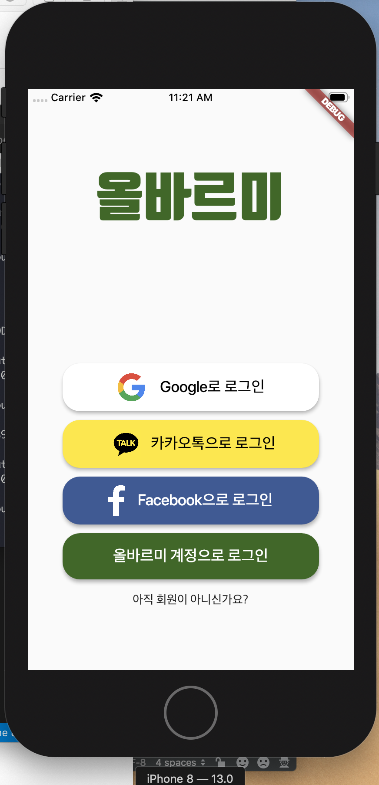

# 👣 Albarumi(올바르미)

## 📋 Purpose
Restarting for initially rejected idea for several contests, we decided to make a cross-platform mobile application, which is called Albarumi(means 'justness' in Korean). This app helps people to find what they lost for each other, 

## 💡 Goals

1. Make sure to design a better experience for users for accessability and convenience.
2. The application must be run in cross-platform(iOS & Android).
3. If possible, additional Progressive Web App should be created.

## 👪 Contributors

- [🔗Unperknown](https://github.com/Unperknown)
- [🔗Taegeon Yoo](https://github.com/taegeon-ryan)
- [🔗Taegeon Lim](https://github.com/Im-Tae)

## 🎞 Prototype

### Initial Prototype

.png)

## 🔑 Technology Stacks

## 📅 Daily Progress

### 8/26 ~ 8/30 : Struggled from an Internet for a Whole Week!🤯

### 9/2 : Set up Development Environment with Flutter

공식 문서에 나와 있는 튜토리얼대로 Flutter 개발 환경 설정을 순조롭게 완료하였다. 앞으로 해야 할 작업이 무엇이 있는지 구체적으로 적기로 했다.
1. 올바르미 프로토타입 다시 디자인하기
2. Dart 언어 빠르게 적응하기
3. 올바르미 PWA 버전 구현 방법 찾아보기

Pros
- 앞으로의 환경을 구성하는 데 개발 환경(Mac)이 최적화가 잘 되어 있어 에러가 발생하지 않고 순조롭게 진행되었다.
- 공식 문서를 빠르게 이해하여 적은 시간 안에 Flutter 개발 환경을 구성할 수 있었다.

Cons
- 모바일 애플리케이션 분야에 대한 구체적인 경험이 없어서 바로 구현 단계로 진입하지 못한 것이 아쉽다.
- 프로토타입 디자인을 해본 적이 없어서 애플리케이션을 제작하기에 앞서 먼저 이 부분에 대한 빠른 적응이 필요하다.

### 9/6 : Teamed up with Assigned Contributors

일차적으로 학교 축제에 전시하는 목적에 따라 프로젝트를 진행하기로 결정하였다. 팀원 각자 Flutter 개발 환경을 구축하고 어떤 방식으로 개발할지 토의하였다. 

Pros
- 팀원을 정하는 과정이 생각보다 순탄하게 진행되었다.
- 팀원 모두 애자일적으로(?) 진행하여 불필요할 수 있는 작업이 대부분 생략되었다.

Cons
- 프로젝트 초기의 준비 과정이 생각보다 많이 소요되었다. 하지만 개발 환경이 올바르게 구축되고 나면 해결될 것으로 예상된다.
- 처음 경험하는 분야라서 도메인 지식이나 개발 역량 등이 부족했다. 앞으로 이 부분에 대해서 많은 탐구를 해야 할 것이다.
- 이 날의 작업을 기획에만 집중해서 Pair Programming 등 프로젝트에 사용할 수 있는 기법을 바로 적용하지 못한 점이 아쉽다.

### 9/24 ~ 9/25 - Gathered Assets and Designed Splash Screen Page and Login Page!

애플리케이션 개발에 필요한 폰트와 이미지를 모으고 시연품을 제작하는 겸 시작 페이지와 로그인 페이지를 완성하였다. 다만, 이 페이지의 뒷 기능(Back-end)은 나중에 할 계획이다.

Pros
- Flutter의 API 문서를 보고 Flutter로 개발된 프로젝트의 과정을 벤치 마킹 삼아 디자인하니 결과물이 준수하게 나올 수 있었다.
- Dart로 애플리케이션을 어떻게 만드는지 감을 잡을 수 있었다.

Cons
- 현재 코드의 가독성이 떨어진다. 어떻게 하면 리팩토링된 Dart 코드를 작성할 수 있을지 고민해보아야 한다.

### 9/26 ~ 9/27 - Connected with Firebase for Third Party Authentication

타 웹페이지의 로그인 API를 불러올 수 있도록 애플리케이션을 Firebase와 연동하였다. 로그인 과정을 간단하게 하기 위해서 Google, Facebook, 카카오톡으로도 바로 회원으로서 이용할 수 있도록 하였다. 다만, 카카오톡 연동은 아직 안 되었으며 안드로이드 디바이스에 대한 API 환경 설정을 추가적으로 해야 한다.

Pros
- Firebase와 Google Cloud Platform에 대해서 자세히 알아볼 수 있었다.

Cons
- 코드의 줄 수가 늘어나면서 MVC 패턴 등을 적용하여 설계하는 것이 필요할 것 같다.
- 현재 코드의 리팩토링이 필요하다.
- 앞으로 여러 디바이스에서 비슷한 비율의 레이아웃을 보여줄 수 있도록 수정해야 한다.
- 카카오톡과의 로그인 연동도 구현해야 하며 안드로이드 디바이스에 대한 API 환경 설정을 해야 한다.

### 9/30 ~ 10/2, 10/7 - Architected the Project with BLOC Pattern

지금까지 작성한 코드를 BLoC 패턴에 따라 전체적으로 리팩토링하였다. 이제 애플리케이션 안의 데이터를 제공하는 Provider 계층, 제공된 데이터를 핸들링하는 Repository 계층, 데이터를 보여주는 BLoC 계층, 사용자에게 데이터를 보여주는 UI 계층으로 나누어 보다 체계적인 구성을 갖추게 되었다.

Pros
- 코드가 구조적으로 정리되어 용도에 따라 알맞게 추적할 수 있게 되었다.
- BLoC 패턴이 무엇인지 알 수 있었다.
- 올바르미 계정(애플리케이션 자체 계정)으로 로그인할 수 있게 되었다.

Cons
- 파일을 나누었음에도 불구하고 여전히 가독성이 떨어지는 부분이 있다.(UI 계층 등)
- BLoC 패턴을 적용하는 데 생각보다 시간이 너무 많이 소요되었다.(4일)

### 10/7 - Made Responsive Application By Devices' Screen Size

UI 계층에서 디바이스 스크린의 크기에 관계 없이 비슷한 UI를 보여줄 수 있도록 하였다.

Pros
- 다양한 디바이스에서 정상적으로 테스트할 수 있는 환경을 만들었다.

Cons
- UI를 구성하는 데 필요한 정량적인 값을 현재 하드 코딩으로 해놓았다. 앞으로 이를 리팩토링할 수 있는 방법을 생각해야 한다.